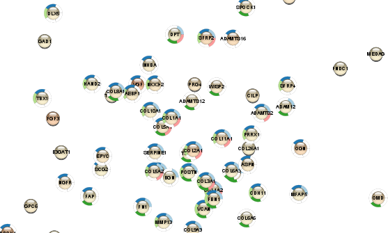

```{r setup, include=FALSE}
knitr::opts_chunk$set(echo = TRUE)
```

```{r}
BiocManager::install("RCy3")
library(RCy3)
```

### My first network

```{r}
nodes <- data.frame(id=c("node 0","node 1","node 2","node 3"),
           group=c("A","A","B","B"), # categorical strings
           score=as.integer(c(20,10,15,5)), # integers
           stringsAsFactors=FALSE)
edges <- data.frame(source=c("node 0","node 0","node 0","node 2"),
           target=c("node 1","node 2","node 3","node 3"),
           interaction=c("inhibits","interacts","activates","interacts"),  # optional
           weight=c(5.1,3.0,5.2,9.9), # numeric
           stringsAsFactors=FALSE)

createNetworkFromDataFrames(nodes,edges, title="my first network", collection="DataFrame Example")

setVisualStyle('Marquee')
```

### My style

```{r}
 style.name = "myStyle_kt"
  defaults <- list(NODE_SHAPE="diamond",
                  NODE_SIZE=30,
                   EDGE_TRANSPARENCY=120,
                   NODE_LABEL_POSITION="W,E,c,0.00,0.00")
  nodeLabels <- mapVisualProperty('node label','id','p')
  nodeFills <- mapVisualProperty('node fill color','group','d',c("A","B"), c("#FF9900","#66AAAA"))
  arrowShapes <- mapVisualProperty('Edge Target Arrow Shape','interaction','d',c("activates","inhibits","interacts"),c("Arrow","T","None"))
 edgeWidth <- mapVisualProperty('edge width','weight','p')
  
  createVisualStyle(style.name, defaults, list(nodeLabels,nodeFills,arrowShapes,edgeWidth))
  setVisualStyle(style.name)
```

### Bioconductor graph example

```{r}
 g = new ('graphNEL', edgemode='directed')
    g = graph::addNode ('A', g)
    g = graph::addNode ('D', g)
    g = graph::addNode ('C', g, edges = list('D'))
    g = graph::addNode ('B', g, edges = list(c('A','D','C')))
    createNetworkFromGraph (g, title='simple network', collection='GraphNEL Example')
```

#### data frames to add node attributes

```{r}
  df <- data.frame (moleculeType=c('kinase','TF','cytokine','cytokine'),
                     log2fc=c(1.8,3.0,-1.2,-2.5),
                     row.names = c('A','B','C','D'), # row.names = node names
                     stringsAsFactors = FALSE)       # important when loading strings!
    loadTableData (df)
```

#### changing the defaults

```{r}
  setNodeShapeDefault ('OCTAGON')
    setNodeColorDefault ('#FF00D5')
    setNodeSizeDefault  (100)
    setNodeFontSizeDefault (60)
```

#### changing visual mapping

```{r}
      getNodeShapes ()
      column <- 'moleculeType'
      values <- c ('kinase',  'TF','cytokine')
      shapes <- c ('DIAMOND', 'TRIANGLE', 'RECTANGLE')
      setNodeShapeMapping (column, values, shapes)
```

```{r}
      column <- 'log2fc'
      control.points <- c (-3.0, 0.0, 3.0)
      colors <-  c ('#5588DD', '#FFFFFF', '#DD8855')
      setNodeColorMapping (column, control.points, colors)
```

```{r}
column <- 'log2fc'
  control.points = c (-3.0, 2.0, 3.0)
    sizes     = c (20, 80, 90)
    setNodeSizeMapping (column, control.points, sizes)
```

### selecting nodes

```{r}
 selectNodes ('C','name')
```

```{r}
  getSelectedNodes ()
```

```{r}
  selectFirstNeighbors ()
```

```{r}
    node.names <- getSelectedNodes ()
```

### saving session

```{r}
  saveSession('vignette_session_kt')
```

### saving high-res images

```{r}
    full.path=paste(getwd(),'vignette_image',sep='/')
    exportImage(full.path, 'PNG', zoom=200)
    ?exportImage
```

### Browse available functions, commands and arguments

#### RCy3 functions

```{r}
help(package=RCy3)
```

### more examples (browse vignettes)

```{r}
browseVignettes("RCy3")
```

## Cytoscape exercises

### Basic Data Visualization: 

##### STRING Protein Query Up-regulated Genes

```{r, fig.align='left'}

```

##### STRING Protein Query Down-regulated Genes

```{r, fig.align='left'}

```
##### STRING Disease Query

```{r, fig.align='left'}

```

